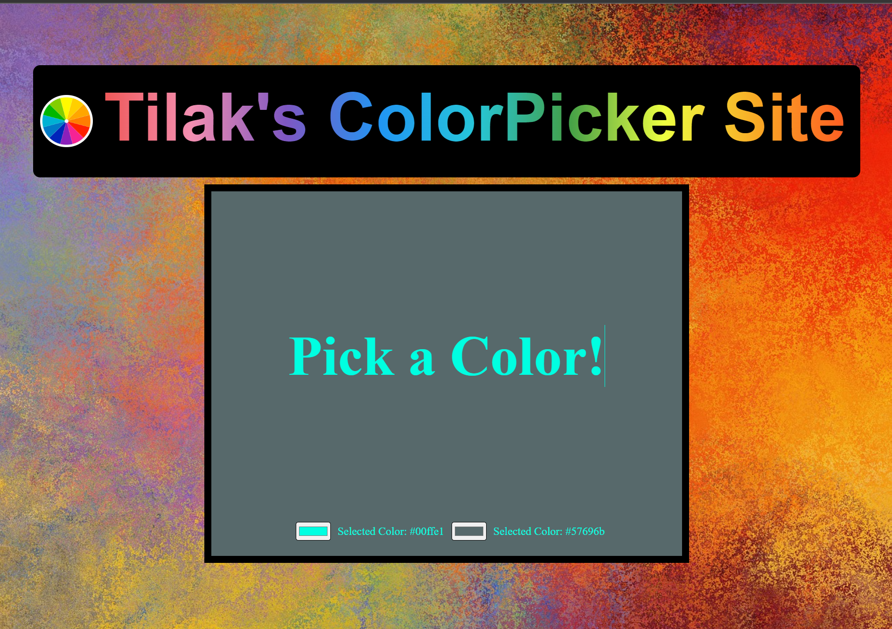

# ColorPicker

Welcome to the ColorPicker project! This website is a fun, interactive tool designed to allow users to pick colors for both text and background, enhancing their experience with dynamic web content. This project is not only about creating a useful tool but also serves as a platform for me to sharpen my skills with React, particularly focusing on using hooks and managing state.

## Features

- **Dynamic Color Selection**: Users can select and immediately see the effects of their color choices on both text and background.
- **React Hooks**: Utilizes `useState` for managing state in a functional component setup.
- **Responsive Design**: Ensures that the color picker is usable on devices of all sizes.

### Prerequisites
- [Node.js](https://nodejs.org/en/) (version 12.x or later)
- npm
## Interface

Here's a look at the ColorPicker in action:

